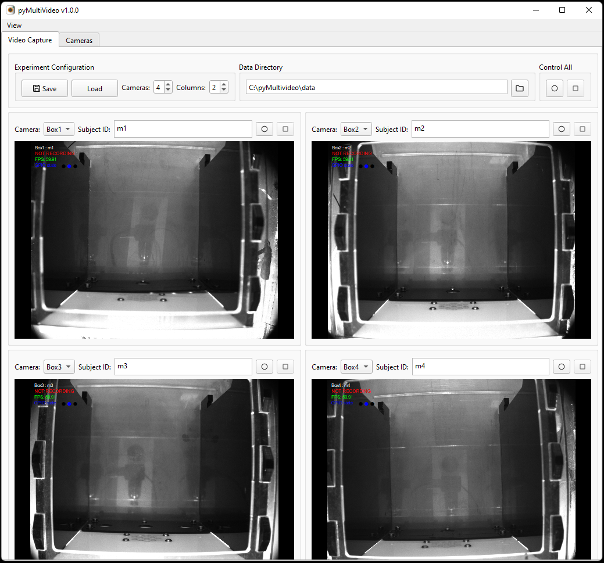

# pyMultiVideo

>**Open source, Python based, Multiple video acquisition.**

## Overview

pyMultiVideo is open source software for acquiring, visualising, compressing and synchronising video from multiple cameras; designed for scientific applications.  It currently supports only FLIR [Chameleon 3](https://www.teledynevisionsolutions.com/products/chameleon3-usb3/) and [Blackfly](https://www.teledynevisionsolutions.com/products/blackfly-s-usb3/#resources-support) cameras but has a modular separation of camera API and GUI code designed to make it straightforward to add support for other camera systems.  

pyMultiVideo code is hosted on [Github](https://github.com/pyMultiVideo), with a [discussion board](https://github.com/orgs/pyMultiVideo/discussions) for user support.

## Features

- Acquisition and visualisation of video and GPIO pin-state data from multiple cameras. 

- h264 and h265 video compression on either the CPU or NVIDA GPU.

- Saving of acquisition configurations and camera settings.

- Fully open source Python application.  The GUI is implemented with PyQt and PyQtGraph, video compression with ffmpeg, and FLIR camera control through the Spinnaker SDK.

## Getting started

See the [installation](./user-guide/installation.md) user guide for installation instructions.

