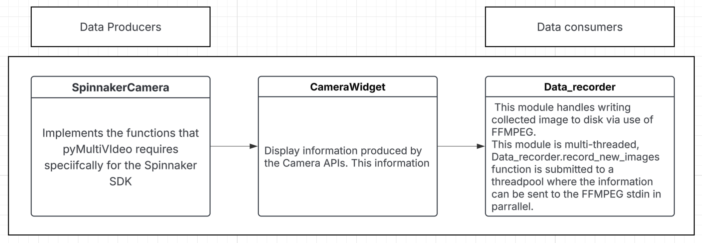

# Information for developers

In this page we outline the design considerations for pyMultiVideo. This will likely be useful if you would like to extend the functionality for pyMultiVideo for your specific use case.

## pyMultiVideo Modules

pyMultiVideo is a python based GUI application for multiple video acqusition.

The PyQt GUI application is currently implemented primarily using two tabs and widget for displaying camera information.

1. `VideoCapture` Tab

This tab is the place where multiple `CameraWidget` widgets can be instantiated at the same time. This allows many different cameras to be able to record video simulatiously.

2. `Cameras` Tab

This tab displays camera acqusition settings that are being used to display acquire the camera image. The acqusition settings are saved out to disk in the `code/config/camera_configs.json` file. It also uses this to load the camera camera configs

### Other modules that are important

- `Data_recorder` module

Plugs into the CameraWidget class as a 'Data Producer' which is then displayed to the CameraWidget class.

- `CameraWidget` module

This module displays the data recieved from the `camera_api.GenericCamera` class. This includes information like the camer image information itself or GPIO data. When in the _Cameras_ tab the `CameraWidget` is used in preview mode and displays additional information about camera acqusition settings (exposure time & gain).

- `camera_api.GenericCamera` module

This widget wraps any functions that are specific to the camera manufactorer. This means that many different camera_api modules can be written to suppport different types camera manufactors. For more information about how to implement a currently unsupported camera manufacter please see the [camera_api](./camera-api-technical-reference.md) reference documentation.

_Figure 1. This diagram demonstrates how the data for this application flows through the application._

## Adding functionality

If you would like to add something on the application wide system, you should consider putting it in the VideoCaptureTab class. Only one VideoCapture tab is instantiated in pyMultiVideo. An example of this includes the Threadpool for sending data to FFMPEG. Since only one threadpool is required for the application (And jobs can be submitted from multiple places).

If you would like to add something on the camera specific level, then you should consider putting it into the CameraWidget class since one of these classes is added specifically for each camera that is initalised for recording. An example for this is the Camera API class. This is specific to each camera so belongs on the level of the CameraWidget.
