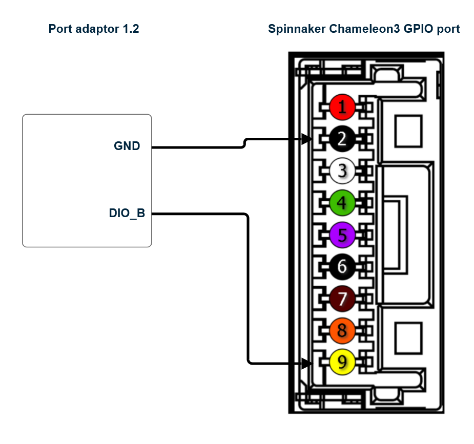
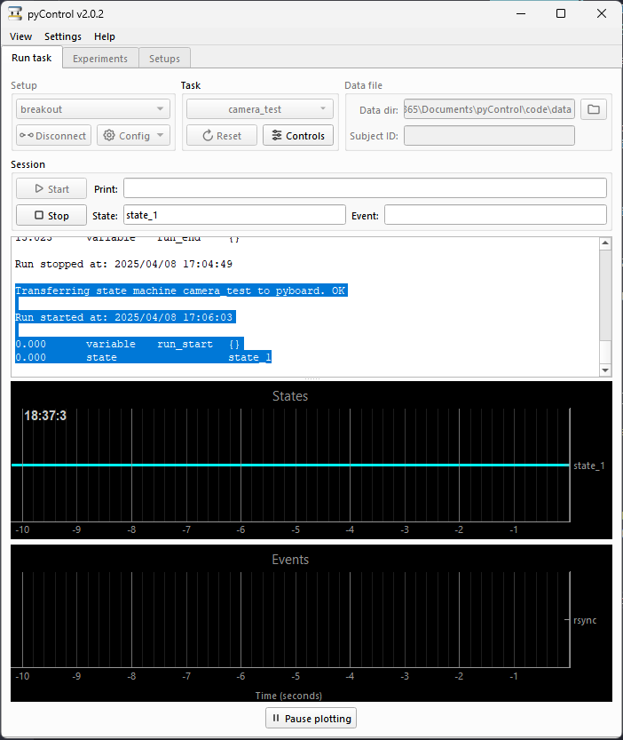
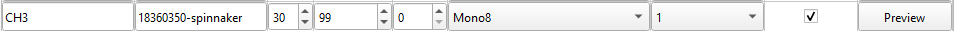

# External Frame triggering

For some experimental use cases, it can useful to only record when an important behaviour needs to be recorded. Instead of continuously recording.

Many scientific camera systems have the capcaptiy to do this using external frame triggering.

## Documentation

- Each CameraAPI class will have a `GenericCamera.trigger_line` attribute. 
- This should be set to the line that want to be triggered. (so it is easily editable within the class.)
- Current implementation is minimal and does not allow you to change the trigger line within the GUI.

### set_acqusition_mode

```python
GenericCamera.set_acquisition_mode(external_trigger: bool)
```

Function called when acqusition mode is changed 

 is the name of the function which is called when the acqusition mode is changed.
If active=True, then the code to set the camera up in external trigger mode is run. If active=False, then the code to set the camera up in interal frame triggering is set. Both need to be implemented so that it can switch between them. 

- `CameraConfig.external_trigger` is the attribute that is saved in the camera config which tell the application whether to run this code. 


## Tutorial


Here I present a tutorial on how pyMultiVideo can implement this.

*Requirements*

1. [pyControl](https://pycontrol.readthedocs.io/en/latest/)
2. [micropython](https://store.micropython.org/product/PYBv1.1) board
3. [Breakout 1.2](https://pycontrol.readthedocs.io/en/latest/user-guide/hardware/#breakout-boards)
4. [Port adaptor](https://github.com/pyControl/hardware/tree/master/Port_adapter)
5. RJ45 Ethernet cable

- Camera:
Spinnaker Chameleon3 Camera
GPIO cable for this camera

*Steps:*

1. Install pyMutliVideo with the PySpin package installed. See instructure for this [here](https://pymultivideo.readthedocs.io/en/latest/user-guide/installation/)
2. Install pyControl onto the machine. See the instructions [here](https://pycontrol.readthedocs.io/en/latest/#installation)

3. Plug in the Pyboard into a USB port and connect to that port. Connect the RJ45 cable from a port on the breakout board to the port adaptor port. In this example I use `port_6`.

4. Connect the port adaptor pins so the ground pin is connected to the GPIO cable's ground pin (black) and the GPIO Line 2 pin (yellow).

   

5. Upload a minimal script for delivering the sync pulses to the GPIO pins to the Pyboard.
   - In the tasks folder: create a new python file e.g. `camera_test.py` and paste the following code into the python module.

```python
# camera_test.py
from pyControl.utility import *
from devices import *

board = Breakout_1_2()

output = Digital_output(pin=board.port_6.DIO_B)

events = [
    "rsync",
]

states = ["state_1"]

initial_state = "state_1"


def state_1(event):
    # pass
    if event == "entry":
       output.pulse(freq=60, duty_cycle=50)
```

- Save this file and upload it to the Pyboard. Click *Start*. The pyControl GUI output should look like this:



Here the pyControl state machine has entered `state_1`, which causes the `output.pulse(freq=60, duty_cycle=50)` code to be run. This effectively sends pulses to `board.port_6.DIO_B` at 60Hz.

1. Connect the GPIO line

5. Open pyMultiVideo and configure the settings of the camera *External Trigger* to be checked.

The camera that you are trying to configure should look similar to this:


This checking this box, runs the `SpinnakerCamera.set_acquisition_mode(True)` function, effectively configuring the camera to run in external frame triggering mode.

By default, the each Camera API has a `trigger_line` attribute which is the name of the pin which will be used to to conifgure the external triggering. In the case of the `SpinnakerCamera.trigger_line` is 2.  
