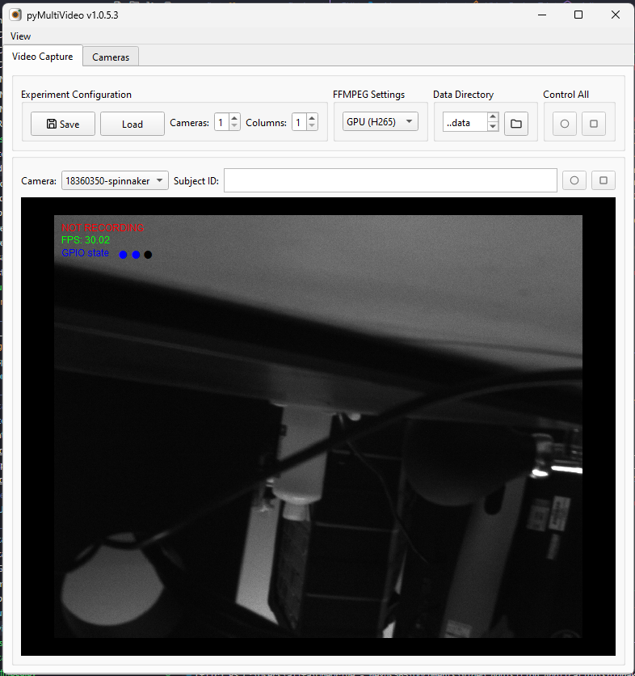
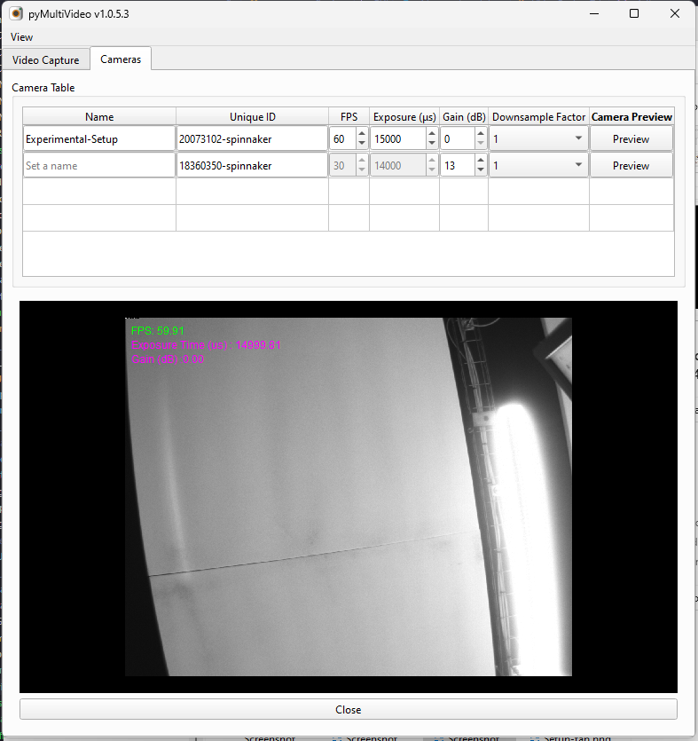

#

## Using the GUI

_Example GUI on startup_

### Start recording

To start recording you must enter a `Subject ID`, the click record.

If all the viewfinder widgets have `Subject ID`, then buttons in the _Control All_ box will be clickable. This allows you to start and stop recording all the cameras that are being used at once.

### Changing the saving directory of the save data

- The default save directory is `/data` folder. This is where the video files, GPIO pin states and recording metadata are saved to disk.
- The save location can be changed by clicking the "_File_" icon and selecting a new save directory.

### Encoding video

- The application uses `ffmpeg` to encode the video to disk. If an NVIDIA GPU is detected by pyMultiVideo, then it will default encode the video with h265.
- Each camera setup can configure its own downsampling factor for the image to be encoded.
- It is also possible to configure further settings such as encoding speed (`fast`, `medium`, `slow`) and the bitrate quality (between 1 - 51) in the `config/config.py` file, under the `ffmpeg_config` dictionary.

### GPIO Pin states Visualisation

If the GPIO states that are being sent to the camera (for [example](https://pycontrol.readthedocs.io/en/latest/user-guide/synchronisation/) for synchronisation for with data streams) are being detected, they will display as colored dots on the viewfinder.

### Creating and saving GUI layouts

If you are frequently using the GUI in a standard way, you might want to save a GUI layout. This can be done by clicking the 'Save' button. This will open a dialog where you can save the current state of the GUI to a json file. This includes the subject IDs, the cameras being displayed further to the FFMPEG encoder selected and the data directory.

- Get the config file from the `/experiments` folder and use that as the input to the `--config` argument

### Full Screen Mode

In the Tool bar there is a _View_ button which contains a toggle to remove (and re-open) the control buttons which is useful for making viewfinder from the camera as big as possible.

!!! tip "Shortcut"
`Ctrl+F` Toggles: shows all the controls in the GUI to maximize the size of the image being displayed

## Cameras Tab

_Example Cameras Tab with preview showing_

The Cameras tab is used to name and configure setups. A camera name can determine how it appears in the drop-down menus on the Video Capture tab. If no name is specified, the camera's unique-id is used to identify a camera in the Camera Selection drop-down menu.

Some camera settings can be configured in the Cameras tab. The frames per second (FPS), Exposure Time and Gain for the cameras can be configured.

To see the impact of these settings on the cameras' output the "Preview" button can be clicked to preview the image at the given settings.

The downsampling factor can also be configured here, if the image quality that you require is lower than that is aquired by default.
