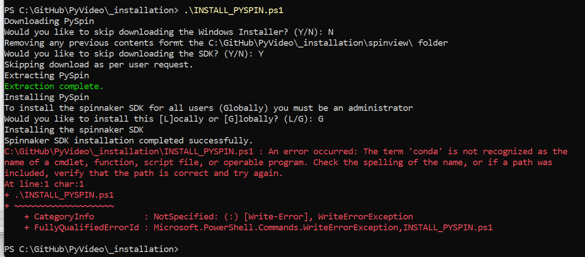
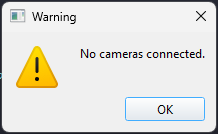
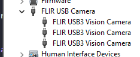
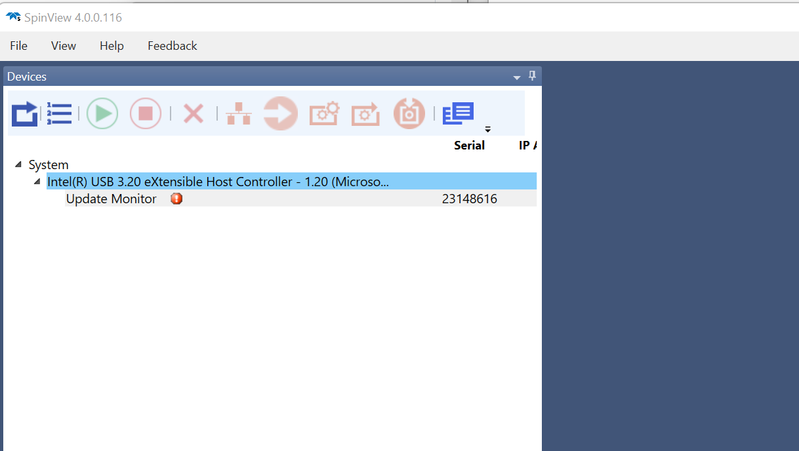

# Troubleshooting

If you are having trouble with starting or using the application, please post on pyMultiVideo's [Issues](https://github.com/pymultivideo/code/issues) page, if the problem that you are having isn't addressed here.

### GPU not encoding video despite the machine having a graphics card

- This means that python is not able detect the nvidia card. Which is likely to due to an driver issue to do with the GPU.
- Ensure that the GPU device is properly being detected by the windows machine by installing the correct driver.
- The following code is being used to detect the presence of a GPU. If this code is not running correctly, the GPU will not be detected.
```python
subprocess.check_output("nvidia-smi")
```

### `conda` hasnt been added to path



For the powershell script to work, it must know the conda command. The powershell requires that you add the installation location of miniconda to the environment variables for the machine.

Do this by adding the following directories to PATH: `C:\Program Files\miniconda3;C:\Program Files\miniconda3\Scripts;C:\Program Files\miniconda3\Library\bin`

[This](https://stackoverflow.com/questions/44597662/conda-command-is-not-recognized-on-windows-10) is a link to a stack exchange post which might be helpful.

### FileNotFoundError: FFMPEG binary not found. Please install FFMPEG and ensure it's in your PATH

This error has occured because `ffmpeg` has not been added to your PATH (or your evironment variables). This should've been done by the ffmpeg installation script. Make sure you have done this. You can confirm this by typing `ffmpeg -version` and seeing the following as your terminal output:

```powershell
ffmpeg version 7.1-essentials_build-www.gyan.dev Copyright (c) 2000-2024 the FFmpeg developers
built with gcc 14.2.0 (Rev1, Built by MSYS2 project)
configuration: --enable-gpl --enable-version3 --enable-static --disable-w32threads --disable-autodetect --enable-fontconfig --enable-iconv --enable-gnutls --enable-libxml2 --enable-gmp --enable-bzlib --enable-lzma --enable-zlib --enable-libsrt --enable-libssh --enable-libzmq --enable-avisynth --enable-sdl2 --enable-libwebp --enable-libx264 --enable-libx265 --enable-libxvid --enable-libaom --enable-libopenjpeg --enable-libvpx --enable-mediafoundation --enable-libass --enable-libfreetype --enable-libfribidi --enable-libharfbuzz --enable-libvidstab --enable-libvmaf --enable-libzimg --enable-amf --enable-cuda-llvm --enable-cuvid --enable-dxva2 --enable-d3d11va --enable-d3d12va --enable-ffnvcodec --enable-libvpl --enable-nvdec --enable-nvenc --enable-vaapi --enable-libgme --enable-libopenmpt --enable-libopencore-amrwb --enable-libmp3lame --enable-libtheora --enable-libvo-amrwbenc --enable-libgsm --enable-libopencore-amrnb --enable-libopus --enable-libspeex --enable-libvorbis --enable-librubberband
libavutil      59. 39.100 / 59. 39.100
libavcodec     61. 19.100 / 61. 19.100
libavformat    61.  7.100 / 61.  7.100
libavdevice    61.  3.100 / 61.  3.100
libavfilter    10.  4.100 / 10.  4.100
libswscale      8.  3.100 /  8.  3.100
libswresample   5.  3.100 /  5.  3.100
libpostproc    58.  3.100 / 58.  3.100
```

## Spinnaker Cameras have not shown up in the GUI

If you see this message then it is likely that pyMultiVideo has not detected the cameras.


You should check if the device manager can detect the cameras, to ensure they are connected to the machine and being detected correctly. You should see a drop down specifically for the FLIR USB Cameras.



This could be for a range of reasons, however is most likely due to the Spinnaker drivers not being installed correctly.

In this case, you should check that the drivers are working in `Spinview`, spinnaker's own recording application, which has more explicit error message for drivers. It might also be that the spinview version is out of date. It is worth trying to reinstall the SpinView application.

If you see something like the following image, then you might have a problem with your drivers. I am not 100% sure why this occurs, however reinstalling the spinnaker drivers from their website might be able to fix it.

